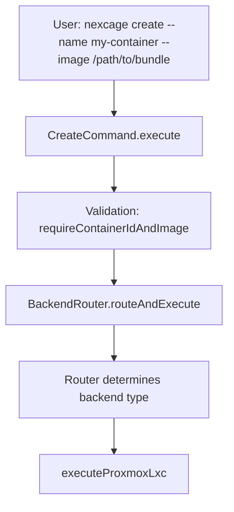
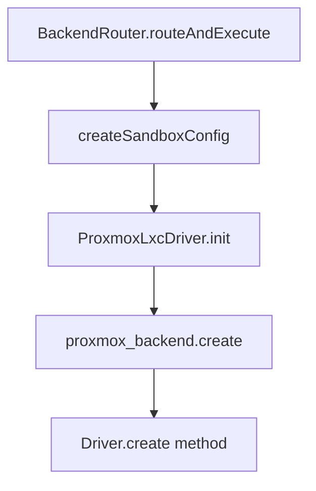
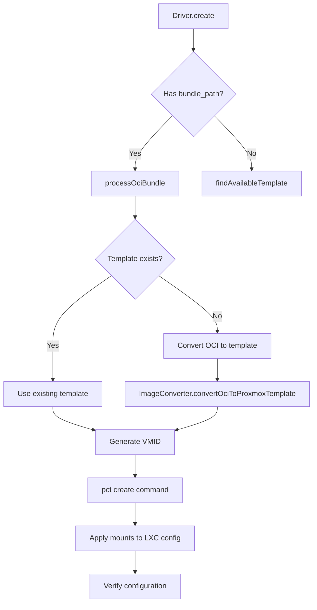
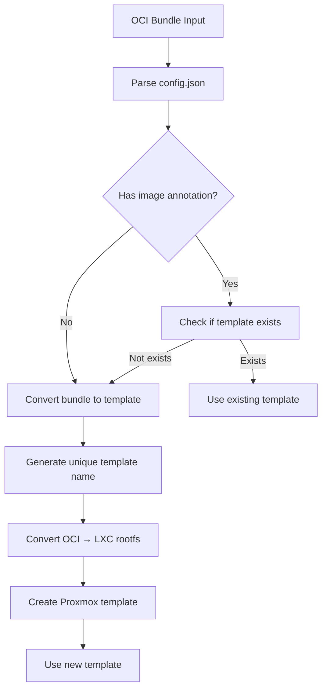

# Create Command Architecture and OCI Bundle Conversion

## Overview

The `create` command in Nexcage implements a sophisticated architecture that automatically handles OCI bundle conversion to Proxmox LXC templates. This document details the complete flow from CLI invocation to container creation.

## Architecture Flow

### 1. CLI Layer (`src/cli/create.zig`)



**Key Components:**
- **Input Validation**: Ensures `--name` and `--image` are provided
- **Backend Routing**: Determines which backend to use (proxmox_lxc, crun, runc, vm)
- **Configuration**: Sets up network config with default bridge

### 2. Router Layer (`src/cli/router.zig`)



**Responsibilities:**
- **Backend Selection**: Routes to appropriate backend based on configuration
- **Sandbox Config**: Creates standardized configuration for all backends
- **Driver Initialization**: Sets up Proxmox LXC driver with default config

### 3. Driver Layer (`src/backends/proxmox-lxc/driver.zig`)



## OCI Bundle Conversion Process

### Automatic Conversion Flow

The conversion process is **completely automatic** and happens transparently during container creation:

#### Step 1: Bundle Detection
```zig
// In driver.create()
if (config.image) |bundle_path| {
    // Process OCI bundle - convert to template if needed
    template_name = try self.processOciBundle(bundle_path, config.name);
}
```

#### Step 2: Template Resolution (`processOciBundle`)
```zig
fn processOciBundle(self: *Self, bundle_path: []const u8, container_name: []const u8) !?[]const u8 {
    // 1. Parse OCI bundle configuration
    var parser = oci_bundle.OciBundleParser.init(self.allocator, self.logger);
    var cfg = try parser.parseBundle(bundle_path);
    
    // 2. Check for existing template
    const maybe_image = try self.parseBundleImageFromConfig(&cfg);
    if (maybe_image) |image_ref| {
        if (try self.templateExists(image_ref)) {
            return image_ref; // Use existing template
        }
    }
    
    // 3. Convert OCI bundle to new template
    const template_name = try std.fmt.allocPrint(self.allocator, "{s}-{d}", .{ 
        container_name, std.time.timestamp() 
    });
    
    var converter = image_converter.ImageConverter.init(self.allocator, self.logger);
    try converter.convertOciToProxmoxTemplate(bundle_path, template_name, "local");
    
    return template_name;
}
```

#### Step 3: Image Conversion (`ImageConverter`)

The `ImageConverter` performs the following steps:

1. **Parse OCI Bundle**: Extract configuration and rootfs path
2. **Extract Rootfs**: Handle tar.zst, tar.gz, or tar archives
3. **Apply LXC Configurations**:
   - Create essential LXC directories (`/dev`, `/proc`, `/sys`, etc.)
   - Set hostname from bundle config
   - Configure network interfaces
   - Set up init system with proper scripts
4. **Create Template Archive**: Compress rootfs to `template_name.tar.zst`
5. **Upload to Storage**: Place in `/var/lib/vz/template/cache/`

### Conversion Decision Logic



## Template Naming Convention

- **Existing Template**: Uses the image reference from `config.json` annotations
- **New Template**: `{container_name}-{timestamp}` (e.g., `my-container-1703123456`)

## File System Operations

### OCI Bundle Structure Expected
```
/path/to/bundle/
├── config.json          # OCI configuration
├── rootfs/              # Container root filesystem
│   ├── bin/
│   ├── etc/
│   ├── usr/
│   └── ...
└── (other OCI files)
```

### Template Creation Process
```
1. Extract rootfs from bundle
2. Apply LXC-specific configurations:
   - /etc/hostname
   - /etc/network/interfaces
   - /sbin/init (LXC init script)
   - Essential directories
3. Create tar.zst archive
4. Place in /var/lib/vz/template/cache/
```

## Error Handling

The conversion process includes comprehensive error handling:

- **Bundle Not Found**: Returns `FileNotFound` error
- **Invalid Bundle**: Validates `config.json` existence
- **Conversion Failure**: Logs detailed error messages
- **Template Creation**: Handles archive creation failures
- **Storage Issues**: Manages upload failures

## Performance Considerations

### Optimization Strategies

1. **Template Caching**: Existing templates are reused instead of re-conversion
2. **Parallel Processing**: Conversion happens during container creation
3. **Incremental Updates**: Only converts when necessary
4. **Memory Management**: Proper cleanup of temporary files

### Resource Usage

- **Disk Space**: Temporary rootfs extraction requires ~2x bundle size
- **CPU**: Archive compression/decompression
- **Memory**: File operations and parsing
- **Network**: None (local operations only)

## Integration Points

### With Existing Systems

1. **Proxmox VE**: Uses standard template storage location
2. **pct CLI**: Leverages existing Proxmox tools
3. **LXC Configuration**: Direct file manipulation for mounts
4. **OCI Standard**: Full compliance with OCI bundle specification

### Backward Compatibility

- **Existing Templates**: Works with pre-existing Proxmox templates
- **Standard Images**: Supports traditional image references
- **Legacy Bundles**: Handles various OCI bundle formats

## Usage Examples

### Basic OCI Bundle Creation
```bash
# Create container from OCI bundle (automatic conversion)
nexcage create --name my-app --image /path/to/oci-bundle

# The system will:
# 1. Detect it's an OCI bundle
# 2. Check for existing template
# 3. Convert to template if needed
# 4. Create container using template
```

### With Existing Template
```bash
# If template already exists, reuse it
nexcage create --name my-app-2 --image /path/to/oci-bundle
# Uses existing template, no conversion needed
```

## Monitoring and Logging

### Log Messages During Conversion

```
INFO: Processing OCI bundle: /path/to/bundle
INFO: Converting OCI bundle to template: my-app-1703123456
INFO: Extracting rootfs: /path/to/bundle/rootfs -> /tmp/lxc-rootfs-my-app-1703123456
INFO: Applying LXC configurations to rootfs
INFO: Creating template archive: my-app-1703123456.tar.zst
INFO: Uploading template to storage: /var/lib/vz/template/cache/
INFO: Successfully converted OCI bundle to template: my-app-1703123456
```

### Debug Information

Enable debug logging to see detailed conversion steps:
```bash
nexcage create --name my-app --image /path/to/bundle --debug
```

## Future Enhancements

### Planned Improvements

1. **Template Sharing**: Share converted templates across nodes
2. **Incremental Conversion**: Only convert changed parts
3. **Template Cleanup**: Automatic removal of unused templates
4. **Conversion Caching**: Cache conversion results
5. **Multi-format Support**: Support for additional container formats

### Extension Points

- **Custom Converters**: Plugin system for different formats
- **Storage Backends**: Support for remote template storage
- **Configuration Templates**: Customizable LXC configurations
- **Validation Rules**: Configurable bundle validation

## Troubleshooting

### Common Issues

1. **Bundle Not Found**: Ensure bundle path is correct and accessible
2. **Permission Denied**: Check write permissions to template storage
3. **Disk Space**: Ensure sufficient space for conversion
4. **Invalid Bundle**: Validate OCI bundle structure

### Debug Commands

```bash
# Check available templates
pveam list local

# Verify bundle structure
ls -la /path/to/bundle/
cat /path/to/bundle/config.json

# Check conversion logs
journalctl -u nexcage -f
```

This architecture ensures that OCI bundle conversion is seamless, automatic, and transparent to the user while maintaining full compatibility with existing Proxmox LXC workflows.
