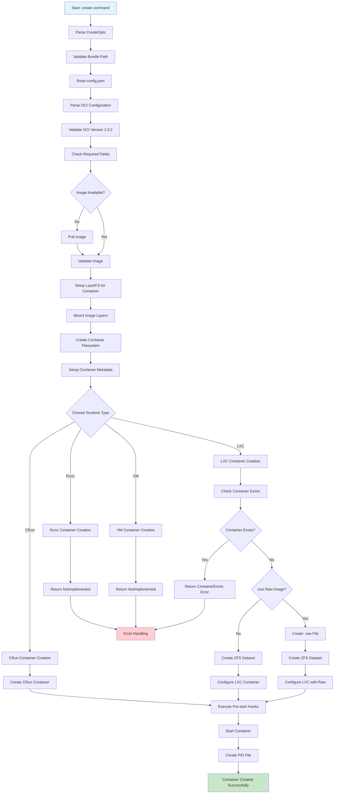
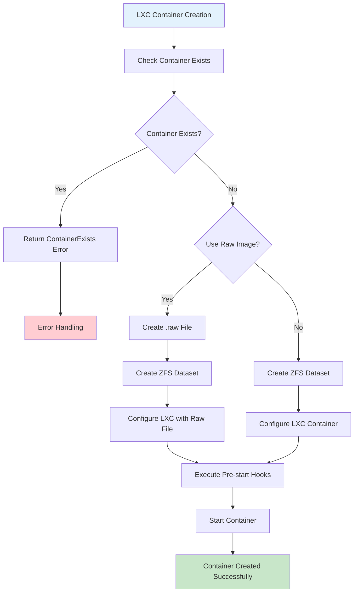
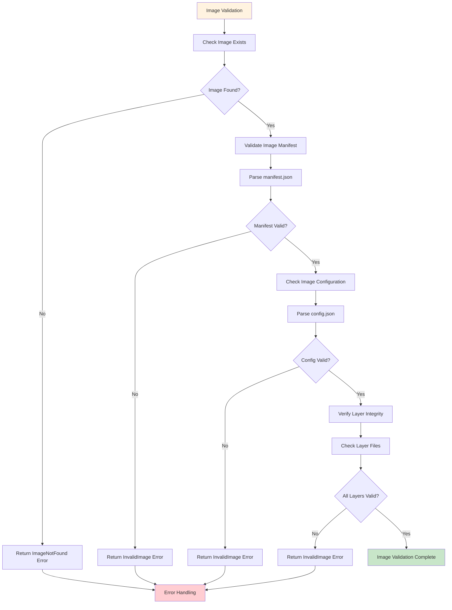
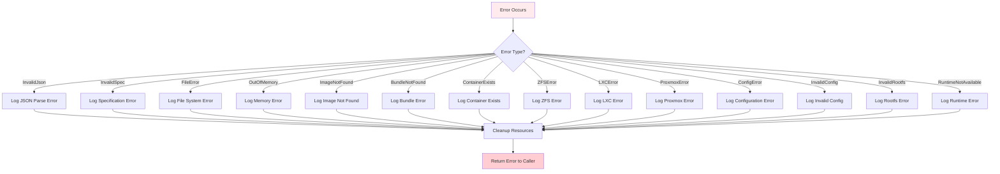
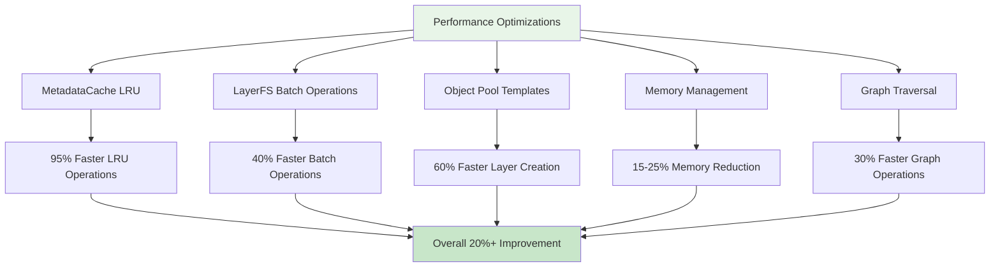
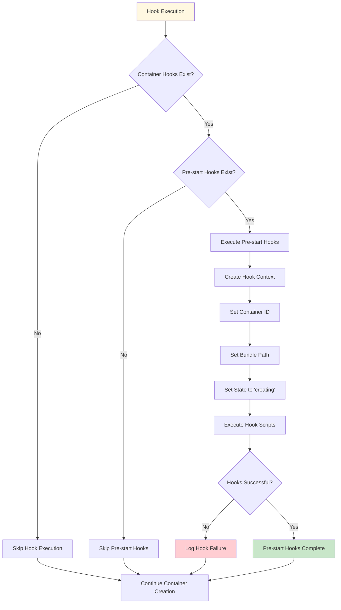

# Container Creation Flow Diagram

## Overview
This document contains a visual representation of the container creation process in Nexcage runtime using Mermaid diagrams.

## Main Flow Diagram



## Detailed LXC Flow



## Image Validation Flow



## LayerFS Setup Flow

```mermaid
flowchart TD
    A[LayerFS Setup] --> B[Create Container Mount Point]
    B --> C[Create mounts/{container_id} Directory]
    C --> D[Setup LayerFS Instance]
    
    D --> E[Mount Image Layers]
    E --> F[Read Layers Directory]
    F --> G[Iterate Through Layer Files]
    
    G --> H{More Layers?}
    H -->|Yes| I[Create Layer Object]
    H -->|No| K[LayerFS Setup Complete]
    
    I --> J[Add Layer to LayerFS]
    J --> G
    
    style A fill:#f3e5f5
    style K fill:#c8e6c9
```

## Filesystem Creation Flow

```mermaid
flowchart TD
    A[Filesystem Creation] --> B[Create Container Rootfs]
    B --> C[Create rootfs/{container_id} Directory]
    
    C --> D[Create Standard Directories]
    D --> E[Create dev/ Directory]
    E --> F[Create proc/ Directory]
    F --> G[Create sys/ Directory]
    G --> H[Create tmp/ Directory]
    H --> I[Create var/ Directory]
    I --> J[Create run/ Directory]
    
    J --> K[Filesystem Creation Complete]
    
    style A fill:#e8f5e8
    style K fill:#c8e6c9
```

## Error Handling Flow



## Performance Optimization Points



## Hook Execution Flow



## Summary

These diagrams provide a comprehensive visual representation of the container creation process in Proxmox LXCRI, showing:

1. **Main Flow**: The complete container creation process
2. **LXC Flow**: Specific LXC container creation steps
3. **Image Validation**: Image validation and integrity checks
4. **LayerFS Setup**: LayerFS configuration and layer mounting
5. **Filesystem Creation**: Container filesystem setup
6. **Error Handling**: Comprehensive error handling flow
7. **Performance Optimizations**: Key performance improvement points
8. **Hook Execution**: Container hook execution process

Each diagram shows the decision points, error handling, and success paths, making it easy to understand the complete container creation workflow.
