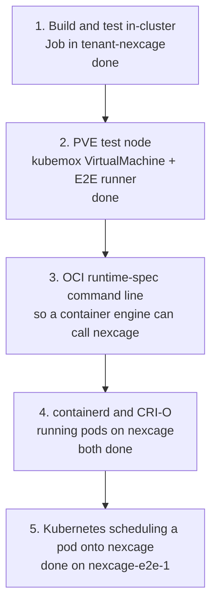

# Kubernetes integration

What nexcage would need to run containers for Kubernetes, and how the work is
staged in the `tenant-nexcage` tenant of the Cozystack cluster `pskep`.

Status as of 0.9.1: nexcage is a command-line lifecycle tool for LXC
containers on one Proxmox VE host. It is not yet an OCI runtime binary in the
sense containerd expects, so nothing in Kubernetes can schedule onto it today.

The way in is the one crun and runc take: containerd and CRI-O call an OCI
runtime binary with the runtime-spec command line. nexcage does not need a
daemon or an operator for that — it needs that command line, and the crun
backend (vendored libcrun) to do the container work behind it.

## What the runtime is missing

The gaps below are what separates the current CLI from something a kubelet, a
containerd shim or an operator can drive. They are ordered by what blocks the
next step, not by size.

| # | Gap | Today | Needed for |
|---|---|---|---|
| 1 | ~~`exec`~~ | **Done on both.** Proxmox LXC runs `pct exec`; crun goes to `libcrun_container_exec_process_file`, so `exec --process <file>` — the shape an engine sends — works, and `crictl exec` runs a command in a pod. Both exit with the command's status | `kubectl exec`, CRI `ExecSync`, exec probes |
| 2 | OCI runtime-spec CLI | **Enough for podman and containerd to run containers.** `create <id> --bundle <dir>`, `--root <dir>`, `--console-socket` and `--pid-file` work; the last two on the crun backend, refused on Proxmox LXC | A containerd shim, and `runc`-compatible tooling generally |
| 3 | ~~`state`~~ | **Done.** Proxmox LXC reports the bundle it recorded; crun hands the question to libcrun, so the output is `crun state`'s | The same. A shim reads the bundle path back from `state` |
| 4 | Missing verbs | `delete --force`, `kill --all` and `features` are done; no `ps`, `events`, `pause`, `resume`, `update`. **Kubernetes asks for `ps --format json`** — seen in the trace on the node, swallowed quietly by containerd, and the pod ran without it | Pod lifecycle, metrics, cgroup updates on resize |
| 5 | No remote surface | CLI only, must run as root on the PVE host | Anything in a Kubernetes pod driving nexcage. A pod cannot call `pct` |
| 6 | No log handling | container output is not captured to a file | Kubelet reads `/var/log/pods/…/0.log`; `kubectl logs` needs it |
| 7 | ~~No CNI~~ | **The engine's, not the runtime's.** containerd and CRI-O create the sandbox's network namespace, run the CNI plugins in it and hand the runtime a path to join. Verified on both: a pod gets an address from host-local and reaches another pod over TCP | Pod IPs from the cluster CNI, `NetworkPolicy`, service routing |
| 8 | No sandbox model | one container per name, no pod grouping | Multi-container pods sharing a network namespace, the pause container |
| 9 | No image service | uses PVE templates, `pveam` and `oci-registry-pull` (PVE 9.1+) | CRI `ImageService`: pull with credentials, list, remove, image FS stats |
| 10 | Fixed resources | 512 MiB and one core unless an OCI bundle sets limits | Translating pod requests and limits into cgroups |
| 11 | Single host | containers on other cluster nodes are not supported | A node per PVE host, or a scheduler that targets more than one |

One further gap is operational rather than functional: nexcage exposes no
health or metrics endpoint a probe can use.

## Constraints found in the pskep cluster

These decide which of the stages below can run where. All three were measured
on the cluster, not assumed.

| Constraint | Consequence |
|---|---|
| No KubeVirt (no `virtualmachines.kubevirt.io`); the Cozystack app catalog here has `bucket`, `etcd`, `info`, `ingress`, `monitoring`, `seaweedfs`, `tenant` only | A Proxmox VE test node cannot be run as a VM inside the cluster. It has to be a VM on a Proxmox host, declared through kubemox |
| Nodes are Talos and report `user.max_user_namespaces=0` inside pods | `tests/sim/run.sh` cannot run in a pod: it needs a user namespace with mounts. Changing it needs `machine.sysctls` in the Talos machine config |
| PodSecurity enforces `baseline` on tenant namespaces by default | Privileged pods are rejected until the namespace is labelled otherwise |
| kubemox is connected to `prox-home` (`ProxmoxConnection` in `tenant-proxmox`, PVE 9.2.20, Ready) | A VM or LXC container on that host can be declared as a Kubernetes object today |

Because of the first two, the in-cluster job in `deploy/kubernetes/tenant-nexcage`
builds and unit-tests nexcage but does not run the simulation suite; it reports
whether the node would allow it, so the day the sysctl changes the job starts
covering it.

## Stages



### Stage 1 — build and test inside the cluster

Done. `deploy/kubernetes/tenant-nexcage/` holds the `Tenant` and a `Job` that
fetches Zig, builds nexcage, runs the unit tests and the smoke checks in
`tenant-nexcage`. It needs nothing from the runtime and no privileges.

What it does not cover: the simulation suite, and anything that calls `pct`.

### Stage 2 — a Proxmox VE test node declared from Kubernetes

Done. `deploy/kubernetes/tenant-nexcage/vm-e2e-node.yaml` is a kubemox
`VirtualMachine` in `tenant-nexcage`; kubemox clones the template
`nexcage-pve-tpl-v0-2` on `prox-home` into the node `nexcage-e2e-1`, a Debian
13 guest running Proxmox VE 9.2.20. `pve-template/` holds the four scripts that
build that template from the Debian cloud image, and
`scripts/register_e2e_runner.sh` registers the Actions runner on the node —
deliberately not in the template, because a registration belongs to one
machine.

`proxmox_e2e.yml` now says `runs-on: [self-hosted, pve9]`, so it lands on that
node rather than on whichever host happens to hold the `proxmox` label, and it
has a step for the registry path: `nexcage run --name … docker.io/library/…`,
which only Proxmox VE 9.1 and later can do. On the node, by hand, the whole
lifecycle works against real `pct` — create, start, `state` with the init's
host PID, kill, stop, delete — and `nexcage run docker.io/library/redis:7`
pulls the image through `oci-registry-pull` and starts it.

Building that node also turned up a defect in what nexcage ships: the release
workflow built with Zig's default native target, so the published binary was
tuned to the GitHub runner's CPU and died with `SIGILL` on the node's Xeon
E5-2697 v2. Both release paths now pass `-Dcpu=baseline`.

One node at a time: the guest's hostname and address are baked into the
template, because a Proxmox node keeps its configuration under
`/etc/pve/nodes/<hostname>` and cannot be renamed after a clone.

### Stage 3 — the OCI runtime-spec command line

In progress. containerd and CRI-O do not talk to a runtime over an API: they
exec a binary with the command line the runtime-spec defines, the same one runc
and crun answer. Everything nexcage needs to be callable that way is CLI shape
and the crun backend behind it.

`exec` is done. What is left, in the order a container engine needs it:

| | What the engine sends | nexcage today |
|---|---|---|
| container id | positional, `create <id>` | done: with `--bundle`, the positional word is the id |
| global | `--root <dir>` — containerd passes its own state directory | done, before or after the command |
| `state` | `bundle` filled in | done, and `start`/`stop` keep it |
| `delete` | `--force` | done: shuts the container down first |
| `kill` | `--all` | accepted, and says what it really does on LXC |
| `create` | `--pid-file <file>`, `--console-socket <sock>` | done on crun: the pty's master end arrives over `SCM_RIGHTS` and is a real tty. Refused on Proxmox LXC, which starts no process on create |
| also read | `ps`, `features`, `pause`, `resume`, `update` | **not yet** |

The crun backend took the bundle path from the container id —
`/var/lib/nexcage/bundles/<id>` — and ignored the one it was given, so it
looked where nothing had written. It uses the caller's directory now, and
honours `--root`; bundles are no longer confined to two directories, because a
container engine picks its own and runc and crun accept any.

`--console-socket` was the first thing the crun backend asked for once it could
report what libcrun says, and it is done: with the flag, `create` on a bundle
whose spec sets `process.terminal` succeeds and the master end of the pty
arrives on the caller's socket —

```
RECEIVED_FDS=1
IS_A_TTY=True
```

— while the same bundle without it still answers `use --console-socket with
create when a terminal is used`. That is the first runtime-spec `create` that
completes on nexcage.

`state` followed, and it is libcrun's own: the JSON is written by
`libcrun_container_state`, so it matches `crun state` for the same container
field for field rather than being a second rendering that can drift. Together
with `create` that is enough for a caller to make a container and read it back:

```
$ nexcage --runtime crun state s1
{ "ociVersion": "1.0.0", "id": "s1", "pid": 30, "status": "created",
  "bundle": "/run/eb/s1", "rootfs": "rootfs", "created": "...",
  "systemd-scope": "", "owner": "root" }
```

`start`, `kill` and `delete` have now been run end to end on this backend for
the first time: `create --console-socket` → `start` → `"status": "running"` →
`delete --force` → gone. Two flags that were accepted and ignored now reach
libcrun: `delete --force`, which the driver had hardcoded to `false`, and
`kill --all`, which goes to `libcrun_container_killall`.

**A container engine drives it.** podman runs a container on nexcage end to
end:

```
$ podman --runtime /usr/local/bin/nexcage run --rm localhost/tiny:1 \
      /bin/sh -c 'echo HELLO_FROM_NEXCAGE'
HELLO_FROM_NEXCAGE

# what podman sent the runtime
create --bundle /var/lib/containers/storage/overlay-containers/<id>/userdata \
       --pid-file /run/containers/.../pidfile <id>
start <id>
delete --force <id>
```

No unexpected options: the command line an engine sends is the one built in
this stage. Two things had to change for it to work, and neither was on the
list of missing verbs — which is the argument for running an engine against it
rather than working down a checklist:

- **The container id was rejected.** `create` applied an RFC-1123 hostname rule
  to it before any backend was chosen, and an engine's id is 64 hex characters
  against a 63-character label limit. That rule belongs to the Proxmox LXC
  backend, where the name really does become a hostname, and now lives there.
- **Routing had to reach the OCI backend.** An engine never passes
  `--runtime`, so the configuration file has to say
  `{ "runtime": { "routing": [ { "pattern": "*", "runtime": "crun" } ] } }`.
  The catch-all in `config.json.example` was `".*"`, which matches nothing: a
  pattern is a regex only when it starts with `^` or ends with `$`, so `.*`
  was read as a wildcard meaning "a literal dot, then anything".

What is still missing: `ps`, `pause`, `resume` and `update` do not exist.
podman did not ask for any of them to run a container. `features` and `exec` were
also on this list and are done — the first because containerd asked at startup,
the second because a kubelet cannot do without it.

`--pid-file` and `--console-socket` are where the Proxmox LXC backend stops
being able to pretend: the runtime-spec means `create` to leave the container's
process alive and waiting, and `pct create` starts nothing, so there is no PID
to write and no console to hand over. Those two belong to the crun backend,
which is also where the rest of the list gets its answers.

The container work behind that command line belongs to the crun backend, which
links vendored libcrun and already has create, start, kill, delete and exec.
The Proxmox LXC backend stays what it is: a different surface, driven by `pct`,
not by a container engine.

**How to test it without containerd.** podman drives an OCI runtime with
exactly this command line, and it is already installed on the build agent:

```bash
podman --runtime /usr/local/bin/nexcage run --rm docker.io/library/alpine:3 echo hi
```

That is a far shorter loop than standing up containerd, and a runtime podman
can drive is a runtime containerd can drive.

### Stage 4 — containerd and CRI-O

containerd runs a container on nexcage:

```
$ ctr run --rm --runc-binary /usr/local/bin/nexcage \
      docker.io/library/alpine:3.20 t2 /bin/echo HELLO_FROM_NEXCAGE
HELLO_FROM_NEXCAGE

# what containerd sent
--root /run/containerd/runc/default --log <taskdir>/log.json --log-format json \
    create --bundle <dir> --pid-file <file> t2
… start t2
… delete t2
… delete --force t2
```

It took three rounds to get there, and each blocker was only visible once the
one before it was gone — none of them was in the table above, which was
predicting `ps` and `features` that containerd never asked for:

1. **`unknown command '--log'`.** containerd puts `--log <file>` and
   `--log-format json` before the command; the loop that finds the command name
   did not skip them, so `--log` was taken for the command.
2. **`open …/log.json: no such file`.** `--log` is not an option to swallow:
   containerd opens that file to find out *why* the runtime failed. nexcage
   writes its log there now, and `--log-format json` writes the shape runc
   writes.
3. **`Time.UnmarshalJSON: input is not a JSON string`.** The `time` field was a
   number; Go's `time.Time` wants RFC 3339. `src/core/rfc3339.zig` formats it.

Then a fourth, which podman had hidden: **an OCI bundle's `config.json`
shadowed nexcage's own.** `./config.json` is first in the configuration search
path, a bundle holds a `config.json` that is a runtime spec, and containerd
runs the runtime from the bundle directory — so the routing rules were replaced
by a file that is not a configuration at all, silently. A file declaring
`ociVersion` is skipped in the search path now, and refused outright when named
with `--config`.

**A CRI pod runs on nexcage.** The runtime handler is the one a kubelet would
name, and `crictl` drives the same interface the kubelet drives:

```toml
# /etc/containerd/config.toml
[plugins.'io.containerd.cri.v1.runtime'.containerd.runtimes.nexcage]
  runtime_type = 'io.containerd.runc.v2'
  [plugins.'io.containerd.cri.v1.runtime'.containerd.runtimes.nexcage.options]
    BinaryName = '/usr/local/bin/nexcage'
```

```
$ crictl runp --runtime nexcage sandbox.json
$ crictl pods
POD ID          STATE   NAME     NAMESPACE   RUNTIME
6190c7b1cca16   Ready   nx-pod   default     nexcage

$ crictl logs "$CTR"
HELLO_FROM_NEXCAGE_CRI
uid=0(root) gid=0(root) groups=0(root),1(bin),…
```

One defect stood between the sandbox and the container, and it is the reason
this had to be run rather than reasoned about: **the runtime was not entering
the bundle it was given.** containerd's shim serves a whole pod, so it runs the
runtime from the *sandbox's* directory while `--bundle` names the container's
own; an OCI spec's `root.path` is relative (`"rootfs"`), and libcrun resolves
it against the working directory. crun and runc `chdir` into the bundle for
exactly this reason. Without it the container's rootfs was looked for inside
the sandbox's — where `/bin/sh` genuinely is absent, because only `/pause`
lives there. The pod sandbox worked throughout, because for it the two
directories are the same one. `tests/crun/foreign_cwd.sh` is the check, and it
needs no engine: create a container from any working directory that is not the
bundle.

The other thing CRI asks for that no engine had asked for before is
**`features`**, and it is answered now. containerd calls it once at startup; it
never stopped a pod, because containerd records the failure and then assumes
nothing, which is also the reason a wrong answer would be worse than none —
what a runtime claims there, a kubelet believes.

So nexcage claims nothing of its own. The document comes from
`libcrun_container_get_features`, the call behind `crun features`, so it is this
build's configuration read from this build:

```
$ nexcage --runtime crun features | jq -c '.linux.cgroup, .linux.mountExtensions'
{"v1":true,"v2":true,"systemd":true,"systemdUser":true}
{"idmap":{"enabled":true}}
```

**`exec` is done on this backend too**, which is what `kubectl exec` and an exec
probe come down to. libcrun has three entry points for it; two take a
`runtime_spec_schema_config_schema_process *`, which libocispec generates from a
JSON schema and which is far larger than the two structs whose hand-written
mirror had just put a features document at the wrong offset. The third takes the
path of a file holding that process as JSON, and libcrun's own parser builds the
struct — a path has no layout to get wrong. So `--process <file>` hands the
engine's own file over untouched, and a command typed on a command line is
written to a temporary spec of the same shape.

Parsing `--process` mattered more than adding the call. Without it the flag fell
through as an unknown option and its *value* became the container id, so
containerd's exec was answered with `exec is not implemented for the crun
backend (/tmp/runc-process68868969)` — the file's path, in the place of a
container.

```
$ crictl exec "$CTR" /bin/echo NEXCAGE_EXEC_OK
NEXCAGE_EXEC_OK
```

containerd reads two things from it — `mountExtensions.idmap` for user
namespaces and `rro` in `mountOptions` for recursive read-only mounts — and
both are libcrun's answers rather than assertions maintained here. `features`
carries no container id, and a container id is nexcage's routing key, so the
backend is resolved the way a container with no name would route. On the
Proxmox LXC backend it refuses and says where the answer lives: `pct` creates
the container there, so the hooks and seccomp a features document promises are
not nexcage's to report.

**CRI-O runs a pod on nexcage too**, and it did not predict containerd any more
than containerd predicted podman:

```toml
# /etc/crio/crio.conf.d/10-nexcage.conf
[crio.runtime.runtimes.nexcage]
runtime_path = "/usr/local/bin/nexcage"
runtime_type = "oci"
runtime_root = "/run/nexcage-crio"
```

```
$ crictl runp --runtime nexcage sandbox.json && crictl logs "$CTR"
HELLO_FROM_NEXCAGE_CRIO
uid=0(root) gid=0(root) groups=0(root),1(bin),…
```

Two things stood in the way, and neither was a container operation:

1. **`--root=/run/nexcage-crio` was read as a command name.** CRI-O writes a
   flag with an `=`, and every parser here read the two-word form only. It even
   mixes them: `create` goes through conmon, which writes `--root=<dir>`, while
   `start`, `state`, `kill` and `delete` come from CRI-O itself with
   `--root <dir>`. runc and crun accept either without noticing the question.
   `--flag=value` is now split into two words before anything looks at the
   vector, and the split stops at a bare `--`, so `exec … -- env FOO=bar` keeps
   its `=`.
2. **`--version`.** CRI-O asks a runtime its version before it will use one,
   and asks with the flag. `version` as a subcommand was the only spelling.
   The flag maps onto the same command, so the two cannot drift.

After that the trace is crun's, call for call, `features` included — and
`features`, which nexcage only grew for containerd, is asked by CRI-O as well.
What made both findings defects rather than guesses was the same control as
before: two runtime handlers in one CRI-O config, one ending in nexcage and one
in `/usr/bin/crun`, same pod, same bundles.

**A pod network, and it is not this runtime's work.** The engine creates the
sandbox's network namespace, runs the CNI plugins in it, and hands the runtime a
path in `linux.namespaces`; joining a namespace by path is what libcrun already
did for the sandbox's pid, ipc and uts. So the verification is what matters
here, and it holds on both engines with a bridge plus host-local:

```
containerd: pod 10.88.0.2, default via 10.88.0.1     CRI-O: pod 10.89.0.2, default via 10.89.0.1

# two pods, two network namespaces, both on nexcage
pod A 10.88.0.4 listens on 8080; pod B 10.88.0.5 connects   ->   SERVED
pod A 10.89.0.5 listens on 8080; pod B 10.89.0.6 connects   ->   SERVED
```

One thing looks like a failure and is not: `ping` to the gateway succeeds under
containerd and fails under CRI-O. `CapEff: 00000000000005fb` in a CRI-O
container has no `CAP_NET_RAW` (bit 13), which is CRI-O's default set, and plain
crun through a second handler fails the same way. TCP between pods needs no raw
socket and works on both, which is what a cluster actually requires.

**This is now a check rather than a story.** `tests/cri/pod_on_nexcage.sh`
creates a pod sandbox and a container in it through containerd's CRI, on a CNI
bridge, and the crun CI job runs it on every pull request. Two things in it are
deliberate. The container's image is not the sandbox's, because the first
version used `pause` for both and **passed on a binary with the bundle defect** —
`/pause` exists in the sandbox's rootfs too, so a container started from the
wrong rootfs looked identical to one started from the right one. And the trace
is asserted: without it the test would pass just as well with runc behind the
handler. It fails on the pre-`chdir` binary with that binary's own message, and
passes on this one.

Of the gaps a pod needs, the CRI run settles three of them, and not because
nexcage grew them: the shim captures the container's output to the file the
kubelet reads, the sandbox holds the namespaces its containers join, and the
cgroup comes from the spec containerd writes. That is the shape of this whole
stage — the engine owns the pod, the runtime owns the container. What is left
from that row is what a cluster adds on top of a plain CNI bridge:
`NetworkPolicy` and service routing, which belong to a CNI plugin and kube-proxy,
not to a runtime.

### Stage 5 — Kubernetes scheduling a pod onto nexcage

Done, on `nexcage-e2e-1`. Everything before this drove a container engine
directly — podman, `ctr`, `crictl`, a standalone kubelet. This adds the two
things only a cluster has, an API server and a `RuntimeClass`, so the pod
arrives the way a user's pod arrives.

`tests/k8s/pod_on_node.sh` is the run: it installs k3s if the node has none,
adds one runtime to the containerd configuration k3s generates, and applies a
pod that names the class.

```toml
# /var/lib/rancher/k3s/agent/etc/containerd/config-v3.toml.tmpl
{{ template "base" . }}

[plugins.'io.containerd.cri.v1.runtime'.containerd.runtimes.nexcage]
  runtime_type = "io.containerd.runc.v2"
[plugins.'io.containerd.cri.v1.runtime'.containerd.runtimes.nexcage.options]
  BinaryName = "/usr/local/bin/nexcage"
```

```yaml
apiVersion: node.k8s.io/v1
kind: RuntimeClass
metadata: { name: nexcage }
handler: nexcage
---
spec:
  runtimeClassName: nexcage
```

```
ok: the pod was accepted with runtimeClassName: nexcage
ok: the pod is Ready
ok: pod IP 10.42.0.5, from the cluster's CNI
ok: kubectl logs returns the container's output
ok: kubectl exec runs a command in the pod
ok: the pod was deleted
PASS: Kubernetes scheduled a pod onto nexcage on nexcage-e2e
```

**What Kubernetes asks a runtime**, recorded on that node — the whole surface,
in one place at last:

```
features
create --bundle <dir> --pid-file <file> <id>      (with --root, --log, --log-format json)
start <id>
ps --format json <id>
exec --process /tmp/runc-process82872205 --detach --pid-file <file> <id>
kill <id> 15
kill <id> 9
kill --all <id> 9
delete <id>
delete --force <id>
```

Two things in that list are worth naming. The `exec` line is the shape stage 4
added for containerd, `--detach` included: without it `kubectl exec` would have
failed here. And **`ps --format json` is asked for and does not exist** —
nexcage answers `unknown command 'ps'`, containerd swallows it without a word in
the journal, and the pod is Ready, logged, exec'd and deleted regardless. It is
the next gap, and like `features` it was found by running the thing rather than
by reading a list.

Getting the binary onto the node took two corrections that have nothing to do
with Kubernetes, and both would have looked like runtime bugs:

- The host is a Xeon E5-2697 v2 with no AVX2, so a build tuned for a newer CPU
  dies with `SIGILL`. `-Dcpu=baseline`, as the release workflow already does.
- The crun build links libyajl, and the node did not have it: `error while
  loading shared libraries: libyajl.so.2`. `libyajl2`, `libseccomp2` and
  `libcap2` are what a crun-enabled nexcage needs present.

The script leaves the node as it found it unless `--keep` is passed, because that
node is the E2E runner. One caution it enforces: `/etc/nexcage/config.json`
routing everything to crun would also be read by the E2E suite's own build,
which has no crun backend, so it is written only when absent and removed after.

## Related

- [architecture/DEPLOYMENT.md](architecture/DEPLOYMENT.md) — where the binary runs today
- [architecture/BACKENDS.md](architecture/BACKENDS.md) — what each backend supports
- `deploy/kubernetes/tenant-nexcage/README.md` — applying the manifests
