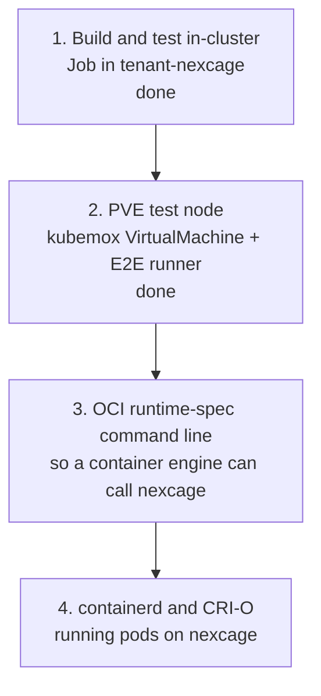

# Kubernetes integration

What nexcage would need to run containers for Kubernetes, and how the work is
staged in the `tenant-nexcage` tenant of the Cozystack cluster `pskep`.

Status as of 0.9.1: nexcage is a command-line lifecycle tool for LXC
containers on one Proxmox VE host. It is not yet an OCI runtime binary in the
sense containerd expects, so nothing in Kubernetes can schedule onto it today.

The way in is the one crun and runc take: containerd and CRI-O call an OCI
runtime binary with the runtime-spec command line. nexcage does not need a
daemon or an operator for that — it needs that command line, and the crun
backend (vendored libcrun) to do the container work behind it.

## What the runtime is missing

The gaps below are what separates the current CLI from something a kubelet, a
containerd shim or an operator can drive. They are ordered by what blocks the
next step, not by size.

| # | Gap | Today | Needed for |
|---|---|---|---|
| 1 | `exec` | **Done on Proxmox LXC**, which runs `pct exec` and exits with the command's status as `runc exec` does. crun and runc have none: libcrun's exec entry point has no binding in `libcrun_ffi.zig` | `kubectl exec`, CRI `ExecSync`, exec probes |
| 2 | OCI runtime-spec CLI | **Partly done.** `create <id> --bundle <dir>`, `--root <dir>`, `--console-socket` and `--pid-file` work; the last two on the crun backend, refused on Proxmox LXC | A containerd shim, and `runc`-compatible tooling generally |
| 3 | ~~`state.bundle`~~ | **Done.** `state` reports the bundle the container was created from, and `start` and `stop` keep it | The same. A shim reads the bundle path back from `state` |
| 4 | Missing verbs | `delete --force` and `kill --all` are done; no `ps`, `events`, `features`, `pause`, `resume`, `update` | Pod lifecycle, metrics, cgroup updates on resize |
| 5 | No remote surface | CLI only, must run as root on the PVE host | Anything in a Kubernetes pod driving nexcage. A pod cannot call `pct` |
| 6 | No log handling | container output is not captured to a file | Kubelet reads `/var/log/pods/…/0.log`; `kubectl logs` needs it |
| 7 | No CNI | `eth0` on `network.bridge` with DHCP | Pod IPs from the cluster CNI, `NetworkPolicy`, service routing |
| 8 | No sandbox model | one container per name, no pod grouping | Multi-container pods sharing a network namespace, the pause container |
| 9 | No image service | uses PVE templates, `pveam` and `oci-registry-pull` (PVE 9.1+) | CRI `ImageService`: pull with credentials, list, remove, image FS stats |
| 10 | Fixed resources | 512 MiB and one core unless an OCI bundle sets limits | Translating pod requests and limits into cgroups |
| 11 | Single host | containers on other cluster nodes are not supported | A node per PVE host, or a scheduler that targets more than one |

One further gap is operational rather than functional: nexcage exposes no
health or metrics endpoint a probe can use.

## Constraints found in the pskep cluster

These decide which of the stages below can run where. All three were measured
on the cluster, not assumed.

| Constraint | Consequence |
|---|---|
| No KubeVirt (no `virtualmachines.kubevirt.io`); the Cozystack app catalog here has `bucket`, `etcd`, `info`, `ingress`, `monitoring`, `seaweedfs`, `tenant` only | A Proxmox VE test node cannot be run as a VM inside the cluster. It has to be a VM on a Proxmox host, declared through kubemox |
| Nodes are Talos and report `user.max_user_namespaces=0` inside pods | `tests/sim/run.sh` cannot run in a pod: it needs a user namespace with mounts. Changing it needs `machine.sysctls` in the Talos machine config |
| PodSecurity enforces `baseline` on tenant namespaces by default | Privileged pods are rejected until the namespace is labelled otherwise |
| kubemox is connected to `prox-home` (`ProxmoxConnection` in `tenant-proxmox`, PVE 9.2.20, Ready) | A VM or LXC container on that host can be declared as a Kubernetes object today |

Because of the first two, the in-cluster job in `deploy/kubernetes/tenant-nexcage`
builds and unit-tests nexcage but does not run the simulation suite; it reports
whether the node would allow it, so the day the sysctl changes the job starts
covering it.

## Stages



### Stage 1 — build and test inside the cluster

Done. `deploy/kubernetes/tenant-nexcage/` holds the `Tenant` and a `Job` that
fetches Zig, builds nexcage, runs the unit tests and the smoke checks in
`tenant-nexcage`. It needs nothing from the runtime and no privileges.

What it does not cover: the simulation suite, and anything that calls `pct`.

### Stage 2 — a Proxmox VE test node declared from Kubernetes

Done. `deploy/kubernetes/tenant-nexcage/vm-e2e-node.yaml` is a kubemox
`VirtualMachine` in `tenant-nexcage`; kubemox clones the template
`nexcage-pve-tpl-v0-2` on `prox-home` into the node `nexcage-e2e-1`, a Debian
13 guest running Proxmox VE 9.2.20. `pve-template/` holds the four scripts that
build that template from the Debian cloud image, and
`scripts/register_e2e_runner.sh` registers the Actions runner on the node —
deliberately not in the template, because a registration belongs to one
machine.

`proxmox_e2e.yml` now says `runs-on: [self-hosted, pve9]`, so it lands on that
node rather than on whichever host happens to hold the `proxmox` label, and it
has a step for the registry path: `nexcage run --name … docker.io/library/…`,
which only Proxmox VE 9.1 and later can do. On the node, by hand, the whole
lifecycle works against real `pct` — create, start, `state` with the init's
host PID, kill, stop, delete — and `nexcage run docker.io/library/redis:7`
pulls the image through `oci-registry-pull` and starts it.

Building that node also turned up a defect in what nexcage ships: the release
workflow built with Zig's default native target, so the published binary was
tuned to the GitHub runner's CPU and died with `SIGILL` on the node's Xeon
E5-2697 v2. Both release paths now pass `-Dcpu=baseline`.

One node at a time: the guest's hostname and address are baked into the
template, because a Proxmox node keeps its configuration under
`/etc/pve/nodes/<hostname>` and cannot be renamed after a clone.

### Stage 3 — the OCI runtime-spec command line

In progress. containerd and CRI-O do not talk to a runtime over an API: they
exec a binary with the command line the runtime-spec defines, the same one runc
and crun answer. Everything nexcage needs to be callable that way is CLI shape
and the crun backend behind it.

`exec` is done. What is left, in the order a container engine needs it:

| | What the engine sends | nexcage today |
|---|---|---|
| container id | positional, `create <id>` | done: with `--bundle`, the positional word is the id |
| global | `--root <dir>` — containerd passes its own state directory | done, before or after the command |
| `state` | `bundle` filled in | done, and `start`/`stop` keep it |
| `delete` | `--force` | done: shuts the container down first |
| `kill` | `--all` | accepted, and says what it really does on LXC |
| `create` | `--pid-file <file>`, `--console-socket <sock>` | done on crun: the pty's master end arrives over `SCM_RIGHTS` and is a real tty. Refused on Proxmox LXC, which starts no process on create |
| also read | `ps`, `features`, `pause`, `resume`, `update` | **not yet** |

The crun backend took the bundle path from the container id —
`/var/lib/nexcage/bundles/<id>` — and ignored the one it was given, so it
looked where nothing had written. It uses the caller's directory now, and
honours `--root`; bundles are no longer confined to two directories, because a
container engine picks its own and runc and crun accept any.

`--console-socket` was the first thing the crun backend asked for once it could
report what libcrun says, and it is done: with the flag, `create` on a bundle
whose spec sets `process.terminal` succeeds and the master end of the pty
arrives on the caller's socket —

```
RECEIVED_FDS=1
IS_A_TTY=True
```

— while the same bundle without it still answers `use --console-socket with
create when a terminal is used`. That is the first runtime-spec `create` that
completes on nexcage.

What it does not yet buy is a lifecycle a caller can follow: `state` is still
missing on this backend, so nothing can read back what was created.

`--pid-file` and `--console-socket` are where the Proxmox LXC backend stops
being able to pretend: the runtime-spec means `create` to leave the container's
process alive and waiting, and `pct create` starts nothing, so there is no PID
to write and no console to hand over. Those two belong to the crun backend,
which is also where the rest of the list gets its answers.

The container work behind that command line belongs to the crun backend, which
links vendored libcrun and already has create, start, kill, delete and exec.
The Proxmox LXC backend stays what it is: a different surface, driven by `pct`,
not by a container engine.

**How to test it without containerd.** podman drives an OCI runtime with
exactly this command line, and it is already installed on the build agent:

```bash
podman --runtime /usr/local/bin/nexcage run --rm docker.io/library/alpine:3 echo hi
```

That is a far shorter loop than standing up containerd, and a runtime podman
can drive is a runtime containerd can drive.

### Stage 4 — containerd and CRI-O

Configuration rather than new code, once stage 3 lands. containerd's
`runc.v2` shim runs any runc-compatible binary through
`options.BinaryName`, and CRI-O takes a `runtime_path`. A pod scheduled to that
runtime handler then runs on nexcage.

What stage 3 does not cover, and a pod needs: container output captured to a
file for `kubectl logs`, pod IPs from the cluster CNI, sandbox grouping so the
containers of one pod share a network namespace, and pod requests and limits
mapped onto cgroups. Those are gaps 6 to 10 in the table above.

## Related

- [architecture/DEPLOYMENT.md](architecture/DEPLOYMENT.md) — where the binary runs today
- [architecture/BACKENDS.md](architecture/BACKENDS.md) — what each backend supports
- `deploy/kubernetes/tenant-nexcage/README.md` — applying the manifests
