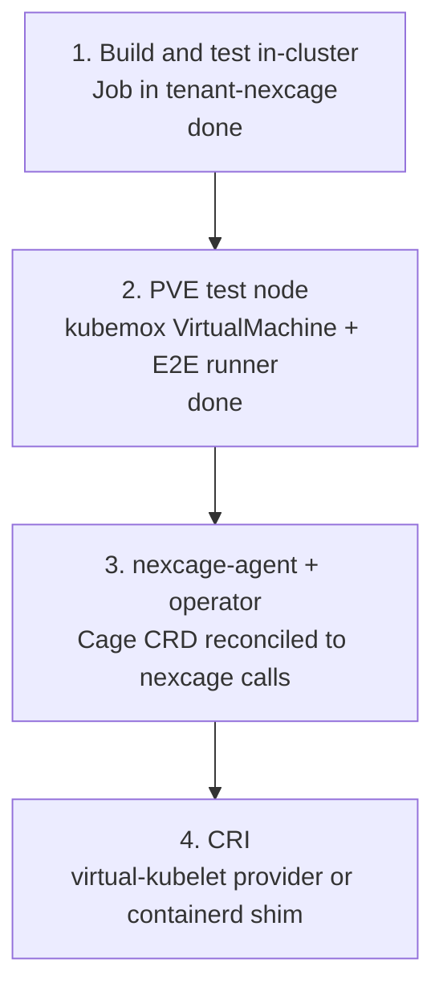

# Kubernetes integration

What nexcage would need to run containers for Kubernetes, and how the work is
staged in the `tenant-nexcage` tenant of the Cozystack cluster `pskep`.

Status as of 0.9.0: nexcage is a command-line lifecycle tool for LXC
containers on one Proxmox VE host. It is not an OCI runtime binary in the
sense containerd expects, and it speaks no CRI. Nothing in Kubernetes can
schedule onto it today.

## What the runtime is missing

The gaps below are what separates the current CLI from something a kubelet, a
containerd shim or an operator can drive. They are ordered by what blocks the
next step, not by size.

| # | Gap | Today | Needed for |
|---|---|---|---|
| 1 | `exec` | `nexcage exec` is parsed in `main.zig` and mapped to `Command.exec`, but no command is registered: it prints "unknown command" | `kubectl exec`, CRI `ExecSync`, exec probes, and any operator that runs a command in a container |
| 2 | OCI runtime-spec CLI | `create --name <name> <image>`; no `create <id> --bundle <dir>`, `--pid-file`, `--console-socket`, `--root` | A containerd shim, and `runc`-compatible tooling generally |
| 3 | `state.bundle` | always `null` | The same. A shim reads the bundle path back from `state` |
| 4 | Missing verbs | no `ps`, `events`, `features`, `pause`, `resume`, `update`, `delete --force` | Pod lifecycle, metrics, cgroup updates on resize |
| 5 | No remote surface | CLI only, must run as root on the PVE host | Anything in a Kubernetes pod driving nexcage. A pod cannot call `pct` |
| 6 | No log handling | container output is not captured to a file | Kubelet reads `/var/log/pods/…/0.log`; `kubectl logs` needs it |
| 7 | No CNI | `eth0` on `network.bridge` with DHCP | Pod IPs from the cluster CNI, `NetworkPolicy`, service routing |
| 8 | No sandbox model | one container per name, no pod grouping | Multi-container pods sharing a network namespace, the pause container |
| 9 | No image service | uses PVE templates, `pveam` and `oci-registry-pull` (PVE 9.1+) | CRI `ImageService`: pull with credentials, list, remove, image FS stats |
| 10 | Fixed resources | 512 MiB and one core unless an OCI bundle sets limits | Translating pod requests and limits into cgroups |
| 11 | Single host | containers on other cluster nodes are not supported | A node per PVE host, or a scheduler that targets more than one |

One further gap is operational rather than functional: nexcage exposes no
health or metrics endpoint a probe can use.

## Constraints found in the pskep cluster

These decide which of the stages below can run where. All three were measured
on the cluster, not assumed.

| Constraint | Consequence |
|---|---|
| No KubeVirt (no `virtualmachines.kubevirt.io`); the Cozystack app catalog here has `bucket`, `etcd`, `info`, `ingress`, `monitoring`, `seaweedfs`, `tenant` only | A Proxmox VE test node cannot be run as a VM inside the cluster. It has to be a VM on a Proxmox host, declared through kubemox |
| Nodes are Talos and report `user.max_user_namespaces=0` inside pods | `tests/sim/run.sh` cannot run in a pod: it needs a user namespace with mounts. Changing it needs `machine.sysctls` in the Talos machine config |
| PodSecurity enforces `baseline` on tenant namespaces by default | Privileged pods are rejected until the namespace is labelled otherwise |
| kubemox is connected to `prox-home` (`ProxmoxConnection` in `tenant-proxmox`, PVE 9.2.20, Ready) | A VM or LXC container on that host can be declared as a Kubernetes object today |

Because of the first two, the in-cluster job in `deploy/kubernetes/tenant-nexcage`
builds and unit-tests nexcage but does not run the simulation suite; it reports
whether the node would allow it, so the day the sysctl changes the job starts
covering it.

## Stages

### Stage 1 — build and test inside the cluster

Done. `deploy/kubernetes/tenant-nexcage/` holds the `Tenant` and a `Job` that
fetches Zig, builds nexcage, runs the unit tests and the smoke checks in
`tenant-nexcage`. It needs nothing from the runtime and no privileges.

What it does not cover: the simulation suite, and anything that calls `pct`.

### Stage 2 — a Proxmox VE test node declared from Kubernetes

Done. `deploy/kubernetes/tenant-nexcage/vm-e2e-node.yaml` is a kubemox
`VirtualMachine` in `tenant-nexcage`; kubemox clones the template
`nexcage-pve-tpl-v0-1` on `prox-home` into the node `nexcage-e2e-1`, a Debian
13 guest running Proxmox VE 9.2.20. `pve-template/` holds the four scripts that
build that template from the Debian cloud image, and
`scripts/register_e2e_runner.sh` registers the Actions runner on the node —
deliberately not in the template, because a registration belongs to one
machine.

`proxmox_e2e.yml` now says `runs-on: [self-hosted, pve9]`, so it lands on that
node rather than on whichever host happens to hold the `proxmox` label, and it
has a step for the registry path: `nexcage run --name … docker.io/library/…`,
which only Proxmox VE 9.1 and later can do. On the node, by hand, the whole
lifecycle works against real `pct` — create, start, `state` with the init's
host PID, kill, stop, delete — and `nexcage run docker.io/library/redis:7`
pulls the image through `oci-registry-pull` and starts it.

Building that node also turned up a defect in what nexcage ships: the release
workflow built with Zig's default native target, so the published binary was
tuned to the GitHub runner's CPU and died with `SIGILL` on the node's Xeon
E5-2697 v2. Both release paths now pass `-Dcpu=baseline`.

One node at a time: the guest's hostname and address are baked into the
template, because a Proxmox node keeps its configuration under
`/etc/pve/nodes/<hostname>` and cannot be renamed after a clone.

### Stage 3 — nexcage-agent and an operator

Gap 5 is the one that has to close first: a small agent on the PVE host that
exposes the nexcage lifecycle over an authenticated API, and an operator in
`tenant-nexcage` that reconciles a `Cage` CRD into calls to it. This is the
kubemox pattern applied to nexcage rather than to the Proxmox API, and it is
what makes `kubectl get cages` meaningful.

Closing gaps 1, 4, 6 and 10 in the runtime makes the operator worth using:
without `exec` there is no debugging, without logs there is no `kubectl logs`,
and without resource mapping every container is 512 MiB.

### Stage 4 — CRI

Two routes, and they are not equivalent.

A **virtual-kubelet provider** registers a node object backed by the agent from
stage 3, and pods scheduled to it become LXC containers. It needs no change on
the Talos nodes, which is why it fits this cluster. It needs gaps 6, 7, 8 and 9
closed: logs, an IPAM story, sandbox grouping and image pulls with credentials.

A **containerd shim** (`containerd-shim-nexcage-v2`) is the conventional route
and needs gaps 2, 3 and 4 closed first, so nexcage behaves like `runc` on the
command line. It also needs containerd and a kubelet on the Proxmox host, which
means that host becomes a cluster node — not something Talos nodes can offer.

## Related

- [architecture/DEPLOYMENT.md](architecture/DEPLOYMENT.md) — where the binary runs today
- [architecture/BACKENDS.md](architecture/BACKENDS.md) — what each backend supports
- `deploy/kubernetes/tenant-nexcage/README.md` — applying the manifests
