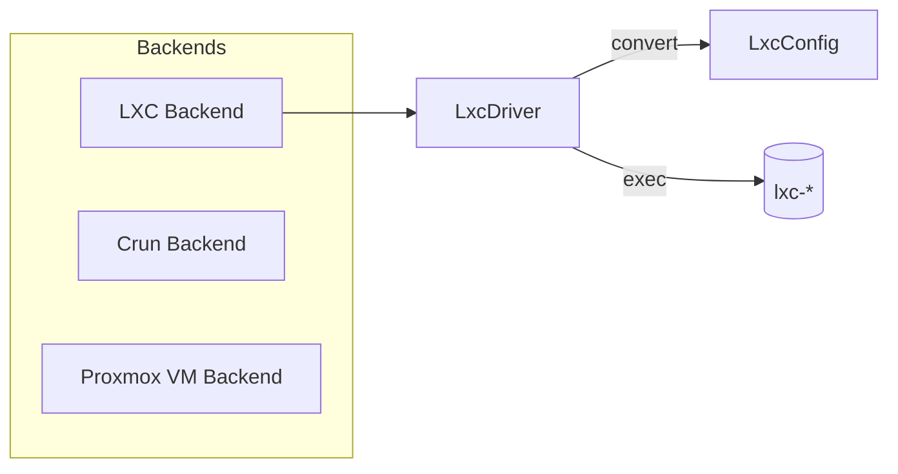
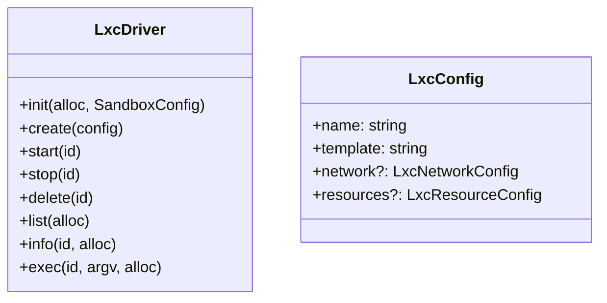

# Backends Architecture

```mermaid
flowchart LR
  subgraph Backends
    LXC["LXC Backend"]
    CRUN["Crun Backend"]
    VM["Proxmox VM Backend"]
  end
  LXC --> DRV["LxcDriver"]
  DRV -->|convert| LxcConfig
  DRV -->|exec| LXC_Tools[("lxc-*")]
```

```mermaid
classDiagram
  class LxcDriver {
    +init(alloc, SandboxConfig)
    +create(config)
    +start(id)
    +stop(id)
    +delete(id)
    +list(alloc)
    +info(id, alloc)
    +exec(id, argv, alloc)
  }
  class LxcConfig {
    +name: string
    +template: string
    +network?: LxcNetworkConfig
    +resources?: LxcResourceConfig
  }
```

