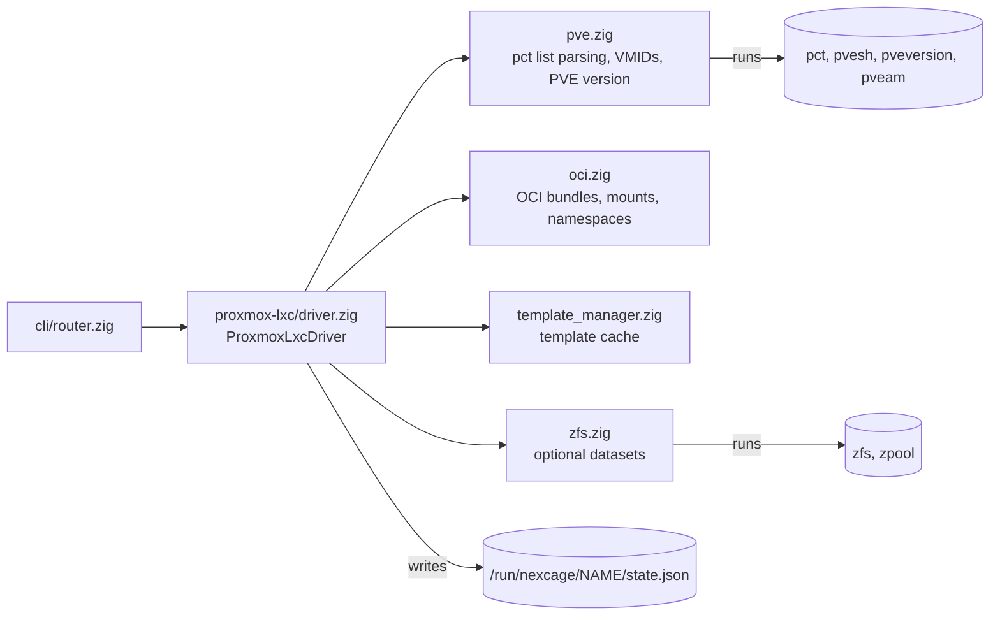

# Backends

`src/backends/mod.zig` compiles each backend in or out with a build option.
The CLI router (`src/cli/router.zig`) sends a command to a backend according
to the routing rules in the config file; without rules everything goes to
Proxmox LXC.

| Backend | Build option | Default | State |
|---|---|---|---|
| Proxmox LXC | `-Denable-backend-proxmox-lxc` | on | Supported; exercised by the Proxmox E2E job |
| crun | `-Denable-backend-crun` | off | Experimental; links vendored libcrun from `deps/crun` |
| runc | `-Denable-backend-runc` | off | Experimental; calls the `runc` binary |
| Proxmox VM | `-Denable-backend-proxmox-vm` | off | Stub; operations only log a warning |

A command routed to a backend that is compiled out fails with
`UnsupportedOperation`.

## Proxmox LXC

| Operation | What the driver runs |
|---|---|
| create | `pvesh get /cluster/nextid`, then `pct create <vmid> <template> --hostname <name> ...`. On Proxmox VE 9.1+ a registry image is pulled first with `pvesh create .../oci-registry-pull` |
| start | `pct start <vmid>` |
| stop | `pct shutdown <vmid> --timeout 60 --forceStop 1` |
| delete | `pct destroy <vmid>` |
| kill | `pct exec <vmid> -- kill -s <signal> 1` |
| list, name to VMID | `pct list` |
