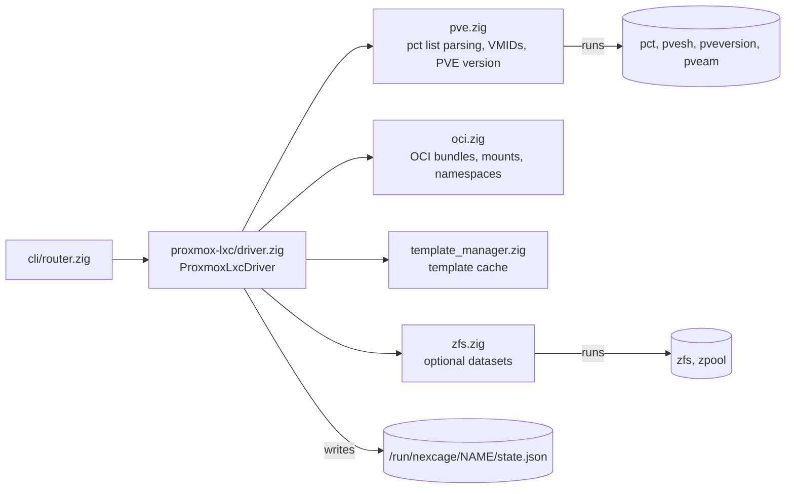

# Backends

`src/backends/mod.zig` compiles each backend in or out with a build option.
The CLI router (`src/cli/router.zig`) sends a command to a backend according
to the routing rules in the config file; without rules everything goes to
Proxmox LXC.

| Backend | Build option | Default | State |
|---|---|---|---|
| Proxmox LXC | `-Denable-backend-proxmox-lxc` | on | Supported; exercised by the Proxmox E2E job |
| crun | `-Denable-backend-crun` | off | Supported for the OCI runtime-spec command line; links vendored libcrun from `deps/crun`. Verified with podman, `ctr`, containerd's CRI, CRI-O and a kubelet; ships as the `-crun` release binary |

A command routed to a backend that is compiled out fails with
`UnsupportedOperation`.

## Proxmox LXC

```mermaid
flowchart LR
  router["cli/router.zig"] --> driver["proxmox-lxc/driver.zig<br/>ProxmoxLxcDriver"]
  driver --> pve["pve.zig<br/>pct list parsing, VMIDs, PVE version"]
  driver --> oci["oci.zig<br/>OCI bundles, mounts, namespaces"]
  driver --> tm["template_manager.zig<br/>template cache"]
  driver --> zfs["zfs.zig<br/>optional datasets"]
  pve -->|runs| tools[("pct, pvesh, pveversion, pveam")]
  zfs -->|runs| ztools[("zfs, zpool")]
  driver -->|writes| state[("/run/nexcage/NAME/state.json")]
```

| Operation | What the driver runs |
|---|---|
| create | `pvesh get /cluster/nextid`, then `pct create <vmid> <template> --hostname <name> ...`. On Proxmox VE 9.1+ a registry image is pulled first with `pvesh create .../oci-registry-pull` |
| start | `pct start <vmid>` |
| stop | `pct shutdown <vmid> --timeout 60 --forceStop 1` |
| delete | `pct destroy <vmid>` |
| kill | `kill(2)` to the container's init from the host, with the PID from `pct status --verbose` — `pct exec` cannot deliver SIGKILL to a namespace's init |
| list, name to VMID | `pvesh get /cluster/resources --type vm` for every node, merged with `pct list` for this one (the cluster view is a cache) |
