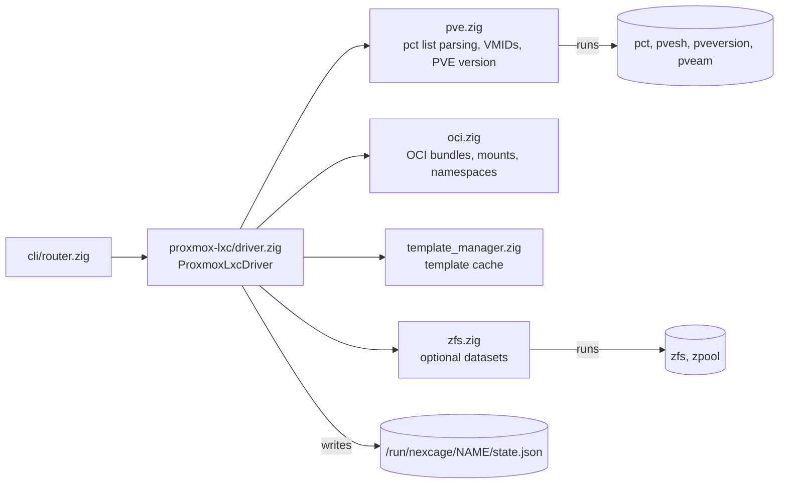

# Backends

`src/backends/mod.zig` always imports the Proxmox LXC backend, and the crun
backend only when its build option (declared in `build.zig`) is on.
The CLI router (`src/cli/router.zig`) sends a command to a backend according
to the routing rules in the config file; without rules everything goes to
Proxmox LXC.

| Backend | Build option | Default | State |
|---|---|---|---|
| Proxmox LXC | — | always | Supported; exercised by the Proxmox E2E job |
| crun | `-Denable-backend-crun` | off | Supported for the OCI runtime-spec command line; links vendored libcrun from `deps/crun`. Verified with podman, `ctr`, containerd's CRI, CRI-O and a kubelet; ships as the `-crun` release binary |

A command routed to a backend that is compiled out fails with
`UnsupportedOperation`.

## Proxmox LXC

```mermaid
flowchart LR
  router["cli/router.zig"] --> driver["proxmox-lxc/driver.zig<br/>ProxmoxLxcDriver"]
  driver --> pve["pve.zig<br/>pct list parsing, VMIDs, PVE version"]
  driver --> oci["oci.zig<br/>OCI bundles, mounts, namespaces"]
  driver --> tm["template_manager.zig<br/>template cache"]
  driver --> zfs["zfs.zig<br/>optional datasets"]
  pve -->|runs| tools[("pct, pvesh, pveversion, pveam")]
  zfs -->|runs| ztools[("zfs, zpool")]
  driver -->|writes| state[("/run/nexcage/NAME/state.json")]
```

| Operation | What the driver runs |
|---|---|
| create | `pvesh get /cluster/nextid`, then `pct create <vmid> <template> --hostname <name> ...`. On Proxmox VE 9.1+ a registry image not already on the storage is pulled first with `pvesh create .../oci-registry-pull`. With `--node` naming another node: only a `<storage>:vztmpl/<file>` template is accepted, `pvesh get /nodes/<node>/storage/<storage>/content --content vztmpl` checks that node has it, then `pvesh create /nodes/<node>/lxc --vmid <vmid> --ostemplate <template> --hostname <name> ...` |
| start | `pct start <vmid>`; on another node `pvesh create /nodes/<node>/lxc/<vmid>/status/start` |
| stop | `pct shutdown <vmid> --timeout 60 --forceStop 1`; on another node `pvesh create /nodes/<node>/lxc/<vmid>/status/shutdown --timeout 60 --forceStop 1` |
| delete | `pct destroy <vmid>`; on another node `pvesh delete /nodes/<node>/lxc/<vmid>`. With `--force`, a running container is stopped first |
| kill | `kill(2)` to the container's init from the host, with the PID from `pct status --verbose` — `pct exec` cannot deliver SIGKILL to a namespace's init; refused for a container on another node |
| exec | `pct exec <vmid> -- <argv>`, stdio inherited; refused for a container on another node, and with `--process` or `--detach` |
| pause, resume | writes `1` / `0` to `/sys/fs/cgroup/lxc/<vmid>/cgroup.freeze` (not `pct suspend`); refused for a container on another node |
| update | `pct set <vmid>` with `--memory`/`--swap`/`--cpulimit`/`--cpuunits`; on another node `pvesh set /nodes/<node>/lxc/<vmid>/config` with the same options |
| snapshot | `pct snapshot <vmid> <name> [--description ...]`; on another node `pvesh create /nodes/<node>/lxc/<vmid>/snapshot --snapname <name> [--description ...]` |
| rollback | `pct rollback <vmid> <name> [--start 1]`; on another node `pvesh create /nodes/<node>/lxc/<vmid>/snapshot/<name>/rollback [--start 1]` |
| delsnapshot | `pct delsnapshot <vmid> <name>`; on another node `pvesh delete /nodes/<node>/lxc/<vmid>/snapshot/<name>` |
| snapshots | `pvesh get /nodes/<node>/lxc/<vmid>/snapshot`, for a container here as well as elsewhere |
| pull, images, rmi | `pvesh create /nodes/<node>/storage/<storage>/oci-registry-pull --reference <ref>`; `pvesh get /nodes/<node>/storage/<storage>/content --content vztmpl` per template storage; `pvesh delete /nodes/<node>/storage/<storage>/content/<volid>` |
| list, name to VMID | `pvesh get /cluster/resources --type vm` for every node, merged with `pct list` for this one (the cluster view is a cache) |
