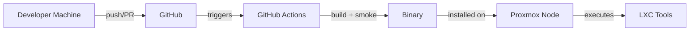

# Deployment Topology

```mermaid
flowchart LR
  Dev[Developer Machine]
  GH[GitHub]
  CI[GitHub Actions]
  Node[Proxmox Node]
  LXC[LXC Tools]

  Dev -- push/PR --> GH
  GH -- triggers --> CI
  CI -- build + smoke --> Artifact[Binary]
  Artifact -- installed on --> Node
  Node -- executes --> LXC
```
