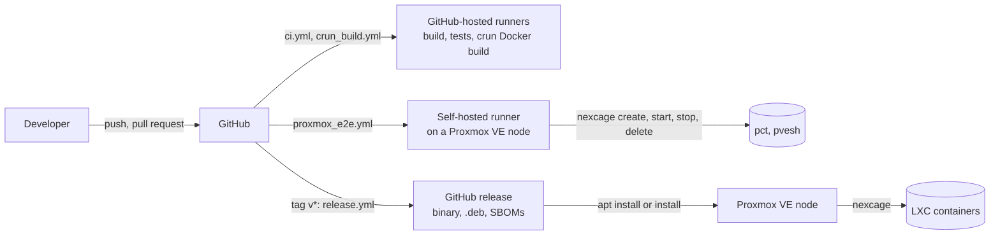

# Deployment Topology

```mermaid
flowchart LR
  Dev[Developer] -- push, pull request --> GH[GitHub]
  GH -- ci.yml, crun_build.yml --> Hosted["GitHub-hosted runners<br/>build, tests, crun Docker build"]
  GH -- proxmox_e2e.yml --> Runner["Self-hosted runner<br/>on a Proxmox VE node"]
  Runner -- nexcage create, start, stop, delete --> E2E[("pct, pvesh")]
  GH -- "tag v*: release.yml" --> Release["GitHub release<br/>binary, .deb, SBOMs"]
  Release -- apt install or install --> Node["Proxmox VE node"]
  Node -- nexcage --> LXC[("LXC containers")]
```
