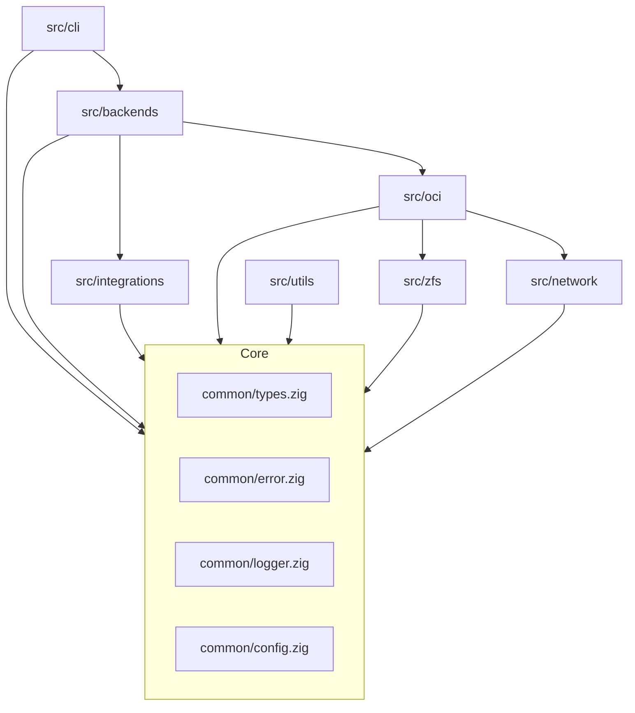

# Modules and Dependencies

```mermaid
flowchart TB
  subgraph Core
    types[common/types.zig]
    error[common/error.zig]
    logger[common/logger.zig]
    config[common/config.zig]
  end

  cli[src/cli]
  backends[src/backends]
  integrations[src/integrations]
  utils[src/utils]
  oci[src/oci]
  zfs[src/zfs]
  network[src/network]

  cli --> Core
  backends --> Core
  integrations --> Core
  oci --> Core
  utils --> Core
  zfs --> Core
  network --> Core

  cli --> backends
  backends --> oci
  backends --> integrations
  oci --> zfs
  oci --> network
```
