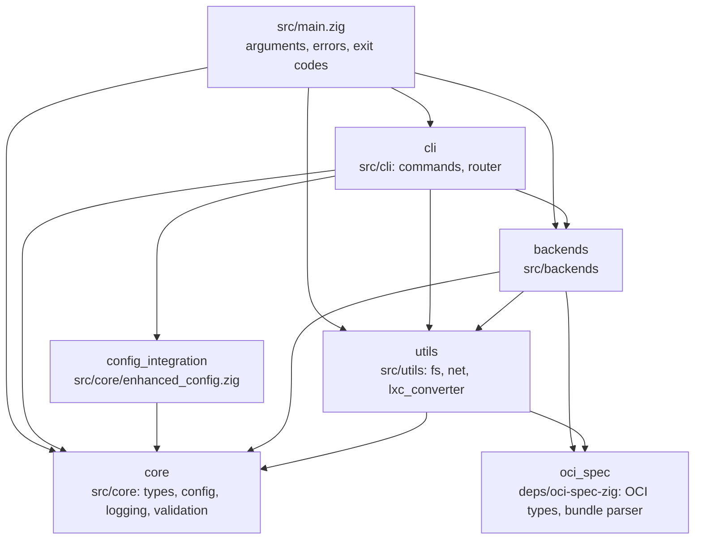

# Modules and Dependencies

`build.zig` wires these Zig modules. An arrow points from a module to a module
it imports.

| Module | Root | Contents |
|---|---|---|
| `core` | `src/core/mod.zig` | Shared types and errors, config loading, logging, input validation, version |
| `cli` | `src/cli/mod.zig` | One file per command; `registry.zig` maps names to commands, `router.zig` picks the backend |
| `backends` | `src/backends/mod.zig` | One directory per backend, each compiled in or out by a build option; see [BACKENDS.md](BACKENDS.md) |
| `utils` | `src/utils/mod.zig` | Filesystem and network helpers, OCI-to-LXC conversion |
| `config_integration` | `src/core/enhanced_config.zig` | Configuration helpers imported by the CLI |
| `oci_spec` | `deps/oci-spec-zig/src/lib.zig` | Vendored copy of oci-specs-zig |
