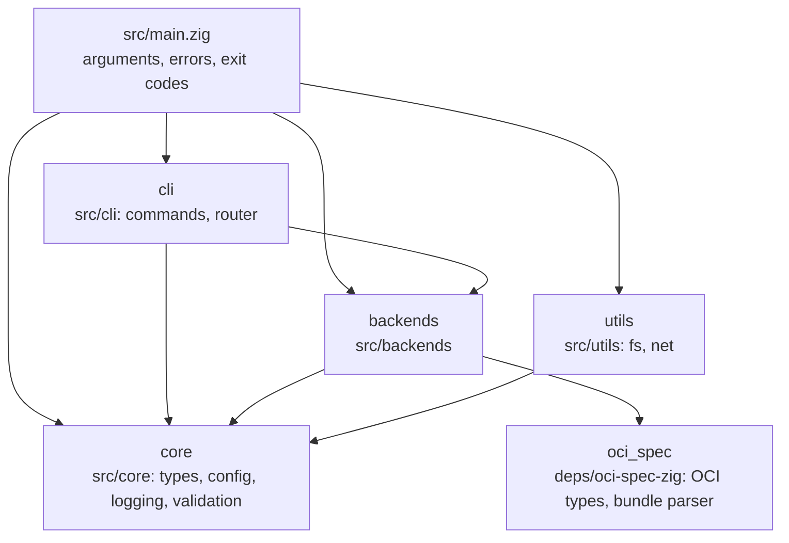

# Modules and Dependencies

`build.zig` wires these Zig modules. An arrow points from a module to a module
it imports.

```mermaid
flowchart TB
  main["src/main.zig<br/>arguments, errors, exit codes"]
  cli["cli<br/>src/cli: commands, router"]
  core["core<br/>src/core: types, config, logging, validation"]
  backends["backends<br/>src/backends"]
  utils["utils<br/>src/utils: fs, net"]
  oci["oci_spec<br/>deps/oci-spec-zig: OCI types, bundle parser"]

  main --> cli
  main --> core
  main --> backends
  main --> utils
  cli --> core
  cli --> backends
  backends --> core
  backends --> oci
  utils --> core
```

`build.zig` also makes `utils` available to `cli` and `backends`, and `oci_spec`
to `utils`, but no source file in those modules imports them.

| Module | Root | Contents |
|---|---|---|
| `core` | `src/core/mod.zig` | Shared types and errors, config loading, logging, input validation, version |
| `cli` | `src/cli/mod.zig` | One file per command, except that `snapshot.zig` holds `snapshot`, `snapshots`, `rollback` and `delsnapshot`; `registry.zig` maps names to commands, `router.zig` picks the backend |
| `backends` | `src/backends/mod.zig` | One directory per backend; crun is compiled in only with its build option; see [BACKENDS.md](BACKENDS.md) |
| `utils` | `src/utils/mod.zig` | Filesystem and network helpers |
| `oci_spec` | `deps/oci-spec-zig/src/lib.zig` | Vendored copy of oci-specs-zig |
