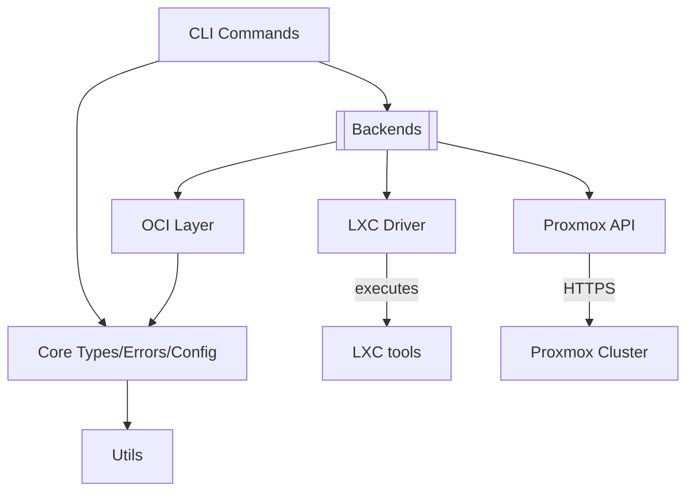
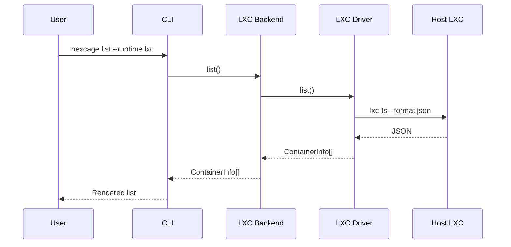

# Architecture Overview

This document describes the high-level system architecture. Diagrams use Mermaid and are rendered directly in GitHub.

```mermaid
flowchart TD
  CLI[CLI Commands]
  CORE[Core Types/Errors/Config]
  BACKENDS[[Backends]]
  LXC[LXC Driver]
  PROX[Proxmox API]
  OCI[OCI Layer]
  UTILS[Utils]

  CLI --> CORE
  CLI --> BACKENDS
  BACKENDS --> LXC
  BACKENDS --> PROX
  BACKENDS --> OCI
  LXC -->|executes| Host[LXC tools]
  PROX -->|HTTPS| Proxmox[Proxmox Cluster]
  OCI --> CORE
  CORE --> UTILS
```

```mermaid
sequenceDiagram
  participant U as User
  participant C as CLI
  participant B as LXC Backend
  participant D as LXC Driver
  participant H as Host LXC

  U->>C: nexcage list --runtime lxc
  C->>B: list()
  B->>D: list()
  D->>H: lxc-ls --format json
  H-->>D: JSON
  D-->>B: ContainerInfo[]
  B-->>C: ContainerInfo[]
  C-->>U: Rendered list
```

