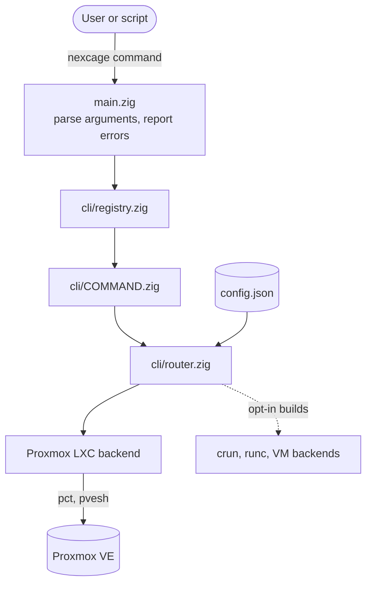
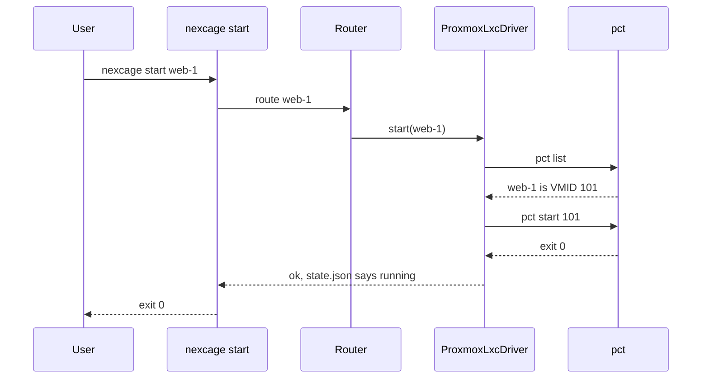

# Architecture Overview

nexcage is a single binary that runs on a Proxmox VE host. It turns CLI
commands into `pct` and `pvesh` calls and keeps a small amount of state under
`/run/nexcage`.

A `start`, end to end:

[MODULES.md](MODULES.md) shows the Zig modules; [BACKENDS.md](BACKENDS.md)
lists what each backend runs.
