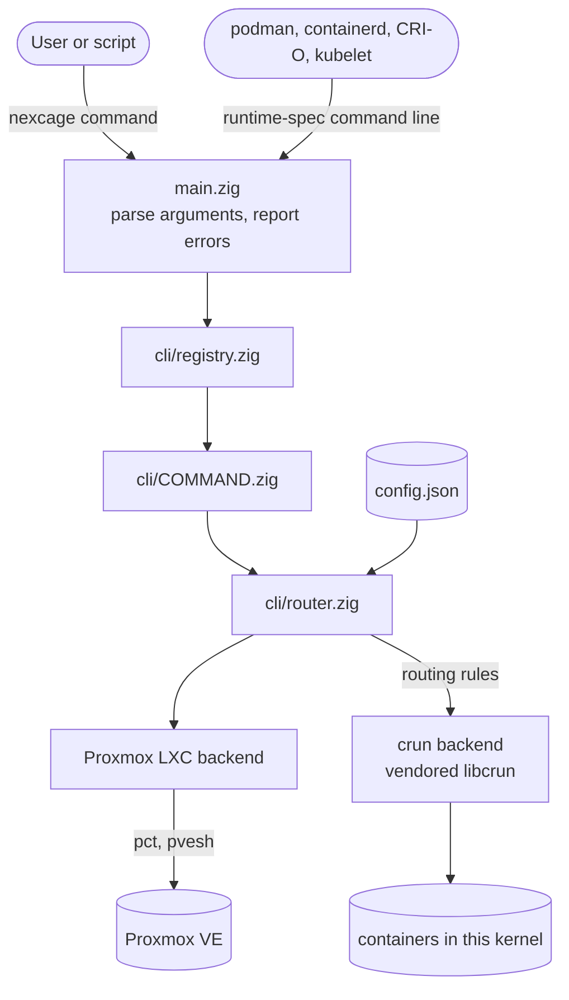
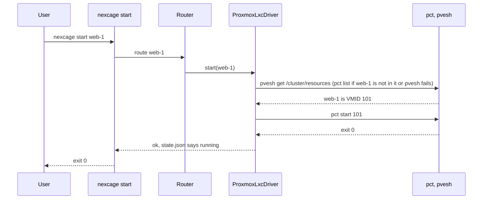

# Architecture Overview

nexcage is a single binary that runs on a Proxmox VE host, and it is called from
two directions.

A person or a script runs `nexcage create`, `start`, `list` and the rest, and
the **Proxmox LXC backend** turns those into `pct` and Proxmox API calls,
keeping a small amount of state under `/run/nexcage`.

A container engine -- podman, containerd, CRI-O, or a kubelet through one of
them -- runs the same binary with the OCI runtime-spec command line, and the
**crun backend** does the container work through vendored libcrun. The engine
never passes `--runtime`, so which backend answers is decided by the routing
rules in the configuration.

```mermaid
flowchart TD
  user([User or script]) -->|nexcage command| main["main.zig<br/>parse arguments, report errors"]
  engine([podman, containerd, CRI-O, kubelet]) -->|runtime-spec command line| main
  main --> registry["cli/registry.zig"]
  registry --> cmd["cli/COMMAND.zig"]
  cmd --> router["cli/router.zig"]
  cfg[("config.json")] --> router
  router --> lxc["Proxmox LXC backend"]
  router -->|routing rules| crun["crun backend<br/>vendored libcrun"]
  crun --> kernel[("containers in this kernel")]
  lxc -->|pct, pvesh| pve[("Proxmox VE")]
```

A `start`, end to end:

```mermaid
sequenceDiagram
  participant U as User
  participant C as nexcage start
  participant R as Router
  participant D as ProxmoxLxcDriver
  participant P as pct, pvesh

  U->>C: nexcage start web-1
  C->>R: route web-1
  R->>D: start(web-1)
  D->>P: pvesh get /cluster/resources (pct list if web-1 is not in it or pvesh fails)
  P-->>D: web-1 is VMID 101
  D->>P: pct start 101
  P-->>D: exit 0
  D-->>C: ok, state.json says running
  C-->>U: exit 0
```

[MODULES.md](MODULES.md) shows the Zig modules; [BACKENDS.md](BACKENDS.md)
lists what each backend runs.
