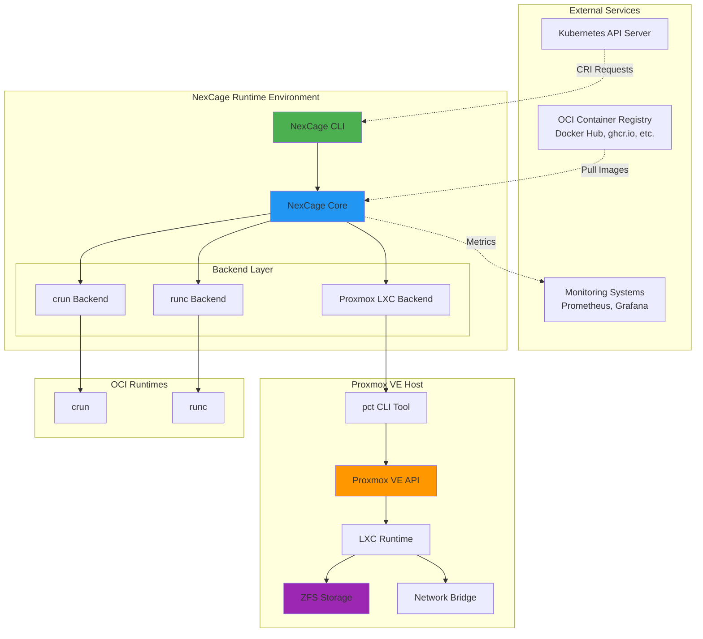
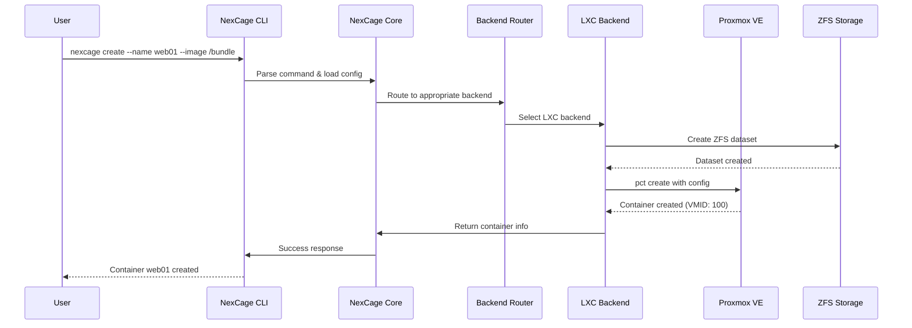
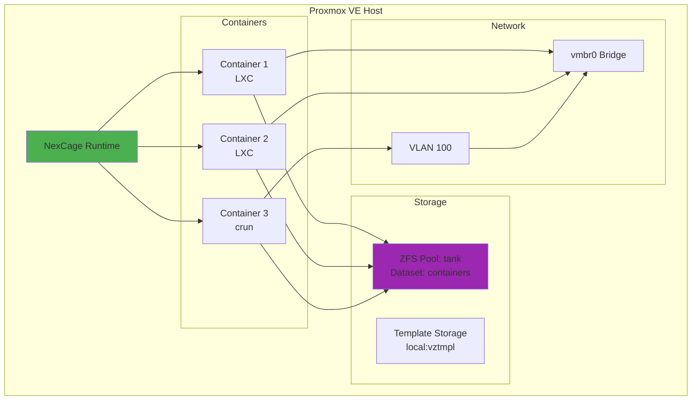
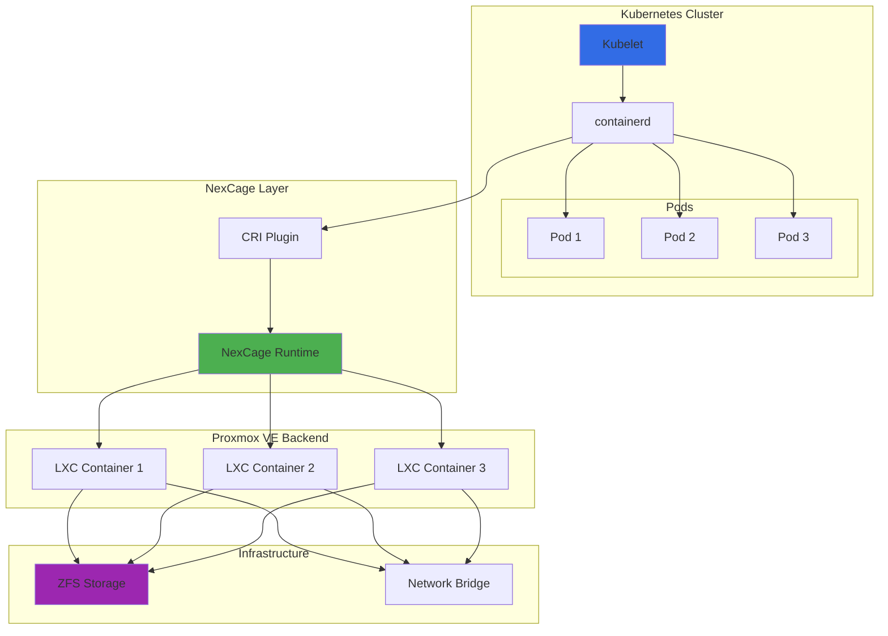
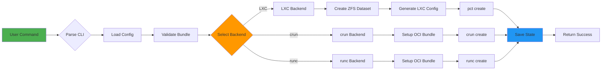
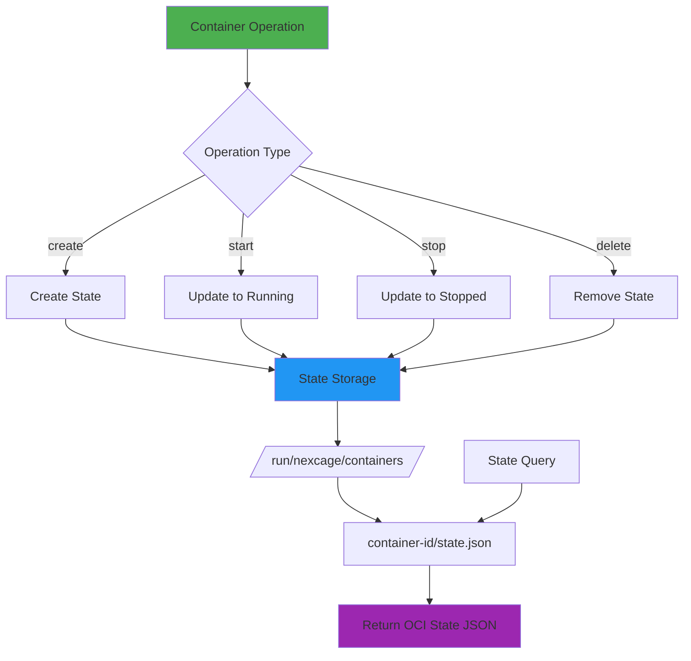
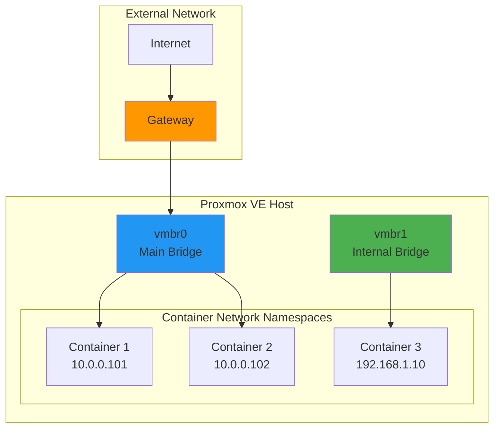
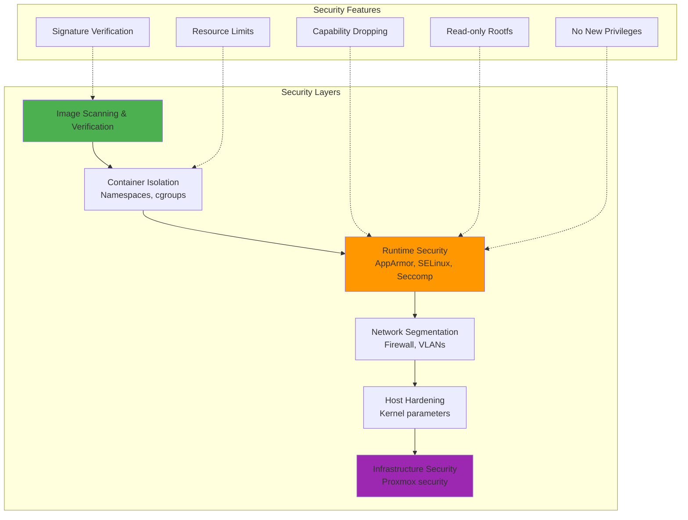
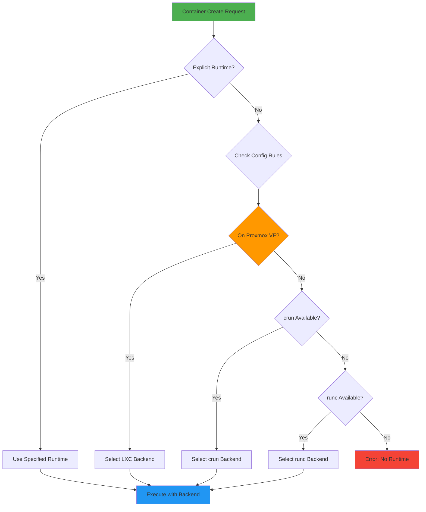

# System Context and Architecture Diagrams

This document provides high-level architectural diagrams showing NexCage's position in the container ecosystem.

## System Context



## Component Interactions



## Deployment Architecture

### Standalone Proxmox Deployment



### Kubernetes Integration Deployment



### High-Availability Cluster

```mermaid
graph TB
    subgraph "Load Balancer"
        LB[HAProxy / Nginx]
    end
    
    subgraph "Proxmox Cluster"
        subgraph "Node 1"
            NC1[NexCage]
            CT1[Containers]
            ZFS1[ZFS Storage]
            NC1 --> CT1
            CT1 --> ZFS1
        end
        
        subgraph "Node 2"
            NC2[NexCage]
            CT2[Containers]
            ZFS2[ZFS Storage]
            NC2 --> CT2
            CT2 --> ZFS2
        end
        
        subgraph "Node 3"
            NC3[NexCage]
            CT3[Containers]
            ZFS3[ZFS Storage]
            NC3 --> CT3
            CT3 --> ZFS3
        end
        
        CLUSTER[Proxmox Cluster<br/>Corosync + pve-cluster]
        
        NC1 --> CLUSTER
        NC2 --> CLUSTER
        NC3 --> CLUSTER
    end
    
    subgraph "Shared Services"
        CEPH[Ceph Storage<br/>(optional)]
        MONITORING[Monitoring<br/>Prometheus]
    end
    
    LB --> NC1
    LB --> NC2
    LB --> NC3
    
    CLUSTER -.-> CEPH
    
    NC1 -.-> MONITORING
    NC2 -.-> MONITORING
    NC3 -.-> MONITORING
    
    style LB fill:#FF5722
    style CLUSTER fill:#FF9800
    style MONITORING fill:#00BCD4
```

## Data Flow Architecture

### Container Creation Flow



### State Management Flow



## Network Architecture



## Security Architecture Layers



## Backend Selection Logic



## Related Documentation

- [Architecture Overview](architecture/OVERVIEW.md) - Detailed architecture
- [Plugin System](architecture/PLUGIN_SYSTEM_ARCHITECTURE.md) - Plugin architecture
- [Security](architecture/ADR-003-Security-Architecture.md) - Security details
- [Deployment](architecture/DEPLOYMENT.md) - Deployment strategies
